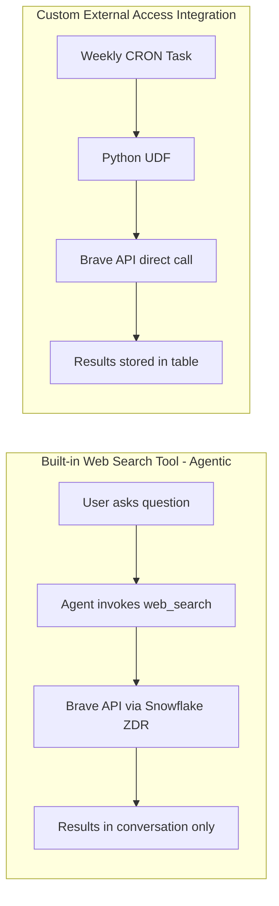

# B2B Sales Intelligence Agent - TELCO_AI_DEMO

A Snowflake Cortex Agent that provides B2B sales intelligence for a Dutch telecom company's top 50 enterprise accounts.

## Architecture

```
TELCO_AI_DEMO.B2B_SALES
├── Star Schema (DIM_COMPANY, DIM_PRODUCT, DIM_SALES_REP, DIM_DATE, FACT_SALES)
├── COMPANY_INTELLIGENCE table (populated weekly by Brave Search)
├── Semantic View (B2B_SALES_SEMANTIC_VIEW)
├── External Access (Brave Search API via Python UDF)
├── Weekly Task (REFRESH_COMPANY_INTELLIGENCE - Sunday 02:00 UTC)
└── Cortex Agent (B2B_SALES_AGENT - 4 tools)
```

### Agent Tools

| Tool | Type | Purpose |
|------|------|---------|
| SalesAnalytics | Cortex Analyst | Natural language queries over the star schema |
| WebSearch | Web Search (Brave) | Real-time internet search during conversations |
| CompanyIntelligenceSearch | Custom UDF | On-demand Brave API search with structured results |
| data_to_chart | Built-in | Generate visualizations from query results |

## Internet Access: Two Approaches

This solution uses **two complementary methods** for accessing internet data about companies. It is important to understand the difference.



| Aspect | Built-in `web_search` (Agentic) | Custom External Access (Brave UDF) |
|--------|-------------------------------|-------------------------------------|
| **How it works** | Agent calls Brave via Snowflake's built-in tool during a conversation | Python UDF calls Brave API via network rule + external access integration |
| **Data flow** | Query + results traverse public internet; Snowflake enforces Zero Data Retention (ZDR) with Brave | Query + results traverse public internet; results stored permanently in COMPANY_INTELLIGENCE table |
| **When to use** | Real-time lookups during agent conversations (breaking news, live events) | Batch processing, historical intelligence tracking, offline analysis |
| **Setup complexity** | Toggle ON in Snowsight (ACCOUNTADMIN, one-time) | Network rule + secret + integration + UDF (requires architecture review) |
| **Governance** | Fully managed by Snowflake; no customer API key needed | Requires customer-managed Brave API key; architecture team must approve external egress |
| **Cost** | Included in Cortex Agents pricing (per-token) | Brave free tier (2,000 queries/month) + warehouse compute for UDF execution |
| **Data persistence** | Ephemeral -- not stored, not queryable after the conversation | Persistent -- stored in Snowflake, queryable by the agent via semantic view |
| **Security review needed** | No (Snowflake manages the integration) | **Yes** -- see Architecture Team Approval below |

### When to Use Which

- **"What is the latest news about ASML?"** -- Agent uses `web_search` (real-time, ephemeral)
- **"Show me intelligence trends for Shell over the past month"** -- Agent queries `COMPANY_INTELLIGENCE` table (batch, historical)
- **"Search the internet for Adyen acquisitions"** -- Agent uses `web_search` for live results, or `CompanyIntelligenceSearch` UDF for a structured Brave API call with stored results

### Architecture Team Approval Required

> **IMPORTANT:** The External Access Integration (`03_external_access.sql`) creates a network egress rule allowing outbound HTTPS traffic to `api.search.brave.com`. This MUST be reviewed and approved by your Architecture/Security team before deployment to production environments.

**Approval considerations:**
- **Data leaving Snowflake:** Only company names + search context strings are sent to Brave's API (no PII, no internal data)
- **API key management:** Stored as a Snowflake SECRET object (encrypted at rest, access-controlled via RBAC)
- **Rate limiting:** Brave free tier enforces a hard cap of 2,000 queries/month; prevents runaway costs
- **Network scope:** Egress is restricted to a single host (`api.search.brave.com`) -- no wildcard access
- **Alternative:** If external access is not approved, the solution still works using only the built-in `web_search` tool (no external access integration required). Remove scripts `03_external_access.sql` and `04_weekly_task.sql` and the `CompanyIntelligenceSearch` tool from the agent spec.

---

## Setup Instructions

### Prerequisites

- Snowflake account with ACCOUNTADMIN role
- Brave Search API key (free tier: https://brave.com/search/api/)
- `COMPUTE_WH` warehouse available

### Deployment Steps

Run the SQL scripts in order:

```bash
# 1. Create schema and tables
snowsql -f 01_schema_and_tables.sql

# 2. Load seed data (50 companies, 10 products, 8 reps, ~1000 sales)
snowsql -f 02_seed_data.sql

# 3. Set up Brave Search external access
snowsql -f 03_external_access.sql

# 4. Create weekly intelligence refresh task
snowsql -f 04_weekly_task.sql

# 5. Create semantic view
snowsql -f 05_semantic_view.sql

# 6. Create the Cortex Agent
snowsql -f 06_cortex_agent.sql
```

### Post-Deployment

1. **Set your Brave API key:**
   ```sql
   ALTER SECRET TELCO_AI_DEMO.B2B_SALES.BRAVE_API_KEY_SECRET
     SET SECRET_STRING = 'your_actual_brave_api_key';
   ```

2. **Enable web search** (one-time, ACCOUNTADMIN):
   - Snowsight > AI & ML > Agents > Settings > toggle "Web search" ON

3. **Test the agent:**
   - Snowsight > AI & ML > Agents > B2B_SALES_AGENT > Playground

## Sample Questions

- "What is our total revenue from Shell this year?"
- "Which sales rep has the highest win rate?"
- "Top 5 companies by deal count in Q1 2025"
- "What products generate the most revenue?"
- "Which companies have contracts expiring in the next 3 months?"
- "What is the latest news about ASML?" (uses web search)
- "Search the internet for recent Adyen acquisitions" (uses web search)

## Cost Estimate

### Scenario 1: Demo/Pilot (50 companies, ~50 agent queries/month)

| Category | Monthly Cost |
|----------|-------------|
| Storage (< 5 MB) | < EUR 0.01 |
| Weekly Task (XS warehouse, ~2 min/week, 50 companies) | ~EUR 0.26 |
| Agent queries (~50/month x 0.19 credits avg) | ~EUR 19.00 |
| Custom tool UDF calls (~10/month) | ~EUR 0.34 |
| Brave API (free tier, ~1,000 calls/month) | EUR 0.00 |
| **Total** | **~EUR 19.60/month** |

### Scenario 2: Production (10,000 companies, 10,000 agent queries/month)

| Category | Calculation | Monthly Cost |
|----------|------------|-------------|
| Storage (~500 MB after 1 year) | 500 MB x EUR 23/TB | ~EUR 0.01 |
| Weekly Task (10,000 companies x 5 results x 4 weeks) | M warehouse ~30 min/week | ~EUR 16.00 |
| Agent queries (10,000/month x 0.19 credits avg) | 1,900 credits | ~EUR 3,800.00 |
| Custom tool UDF calls (~500 on-demand/month) | XS warehouse, ~2 min total | ~EUR 0.70 |
| Brave API (10,000 companies x 5 results x 4 weeks = 200,000 calls) | Brave Data for AI plan | ~EUR 300.00 |
| **Total** | | **~EUR 4,117/month** |

### Key Assumptions and Scaling Notes

| Factor | Demo (50 companies) | Production (10,000 companies) |
|--------|---------------------|-------------------------------|
| Brave API tier | Free (2,000 queries/month) | Data for AI ($3 per 1,000 queries) |
| Weekly task warehouse | XS (1 credit/hr) | M (4 credits/hr) -- parallelism needed |
| Task runtime | ~2 minutes | ~30 minutes (with batching) |
| Agent cost per query | ~0.19 credits (validated) | ~0.19 credits (same model) |
| COMPANY_INTELLIGENCE growth | ~1,000 rows/month | ~200,000 rows/month |
| Storage (1 year) | < 5 MB | ~500 MB |

**Notes:**
- Agent cost of **0.19 credits/query** is based on actual measured usage (0.57 credits / 3 requests = 0.19 each)
- At 10,000 queries/month, the dominant cost is Cortex Agent token usage (~92% of total)
- Brave API "Data for AI" plan pricing: approximately USD 3 per 1,000 queries (see https://brave.com/search/api/)
- Warehouse sizing for 10,000 companies: consider Medium (4 credits/hr) with batching in the stored procedure, or serverless compute for auto-scaling
- For 10,000+ agent queries, consider implementing caching or pre-computed answers for common questions to reduce token consumption

See `07_finops_monitoring.sql` for detailed cost monitoring queries, budget alerts, optimization strategies, and health checks.

## Data Model

- **50 companies**: Shell, ASML, Philips, ING, Heineken, Unilever, Ahold Delhaize, and 43 more
- **10 products**: Enterprise SD-WAN, Cloud Connect, Private 5G, UCaaS, IoT Platform, etc.
- **8 sales reps**: Covering Randstad, Zuid-Holland, Noord-Brabant, Utrecht, Noord-Holland, Gelderland, Limburg
- **~1000 transactions**: 2 years of monthly deal data (WON/LOST/PENDING)
- **3 account tiers**: PLATINUM (10), GOLD (14), SILVER (26)

## Monitoring

Track costs with:
```sql
SELECT start_time::date AS day, service_type, SUM(credits_used) AS credits
FROM SNOWFLAKE.ACCOUNT_USAGE.METERING_HISTORY
WHERE service_type IN ('SERVERLESS_TASK', 'AI_SERVICES')
  AND start_time >= DATEADD(MONTH, -1, CURRENT_TIMESTAMP())
GROUP BY 1, 2 ORDER BY 1 DESC;
```
